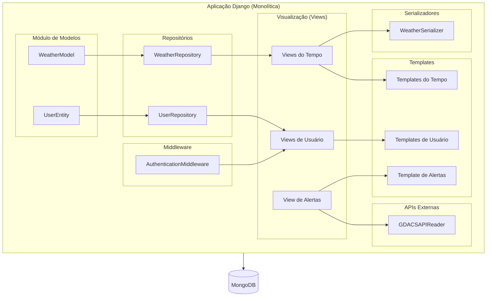

# Weather Forecast API com Monitoramento de Desastres Naturais

Este projeto é uma API de previsão do tempo construída com Django e Django Rest Framework, com integração a um sistema de monitoramento de desastres naturais utilizando a [GDACS](https://www.gdacs.org/) (Global Disaster Alert and Coordination System). Ele oferece uma interface para inserir, consultar, atualizar e remover informações meteorológicas em um banco de dados MongoDB e também para consultar eventos de desastres naturais em tempo real.

## Funcionalidades

- CRUD completo para previsão do tempo.
- Consulta de desastres naturais em tempo real.
- Integração com MongoDB para armazenamento dos dados meteorológicos.
- Uso do GDACSAPIReader para integração com a API de alertas de desastres naturais.
- Templates HTML para visualização de dados.

## Tecnologias Utilizadas

- **Python 3.x**
- **Django**: Framework web.
- **Django Rest Framework**: Para construção das APIs.
- **MongoDB**: Banco de dados para armazenamento das previsões.
- **GDACS API**: Integração para obter alertas de desastres naturais.
- **Pymongo**: Driver para integração do Django com MongoDB.

## Estrutura do Projeto

- **models.py**: Modelos da aplicação, incluindo o modelo `WeatherModel` que representa uma previsão do tempo.
- **serializers.py**: Serializadores para conversão de dados entre as instâncias de modelos e formatos JSON.
- **views.py**: Controladores de CRUD para `WeatherModel` e view de integração com a API externa de desastres naturais.
- **urls.py**: Rotas para acessar as funcionalidades de previsão do tempo e desastres naturais.
- **templates/**: Diretório contendo os templates HTML para visualização dos dados.
- **repositories/**: Repositório que facilita o acesso ao banco de dados MongoDB.
- **settings.py**: Configuração de acesso ao MongoDB e integração com o core da aplicação.

## Instalação

1. Clone o repositório:

   ```bash
   git clone https://github.com/seu_usuario/weather_forecast_api.git
   cd weather_forecast_api

2. Crie e ative um ambiente virtual:
   
   ```bash
    python -m venv venv
    source venv/bin/activate  # Linux/MacOS
    venv\Scripts\activate  # Windows
   
2. Instale as dependências:
   
   ```bash
    pip install -r requirements.txt

## Rotas
### Previsão do Tempo

    GET /weather/: Retorna uma lista de previsões de tempo.
    POST /weather/create/: Cria uma nova previsão de tempo.
    GET /weather/get/<str:pk>/: Retorna uma previsão específica pelo id.
    PUT /weather/update/<str:pk>/: Atualiza uma previsão existente.
    DELETE /weather/delete/<str:pk>/: Remove uma previsão de tempo.
    GET /weather/city/<str:city>/: Retorna previsões de uma cidade específica.

### Desastres Naturais

    GET /alert/: Retorna os 10 últimos alertas de desastres naturais em tempo real.

## Configurações Adicionais

    O projeto utiliza a API GDACS para consultar eventos de desastres naturais. Nenhuma chave de API é necessária, porém, é importante garantir acesso à internet no servidor.

## Diagrama do projeto: 



## Contribuições

  Contribuições são bem-vindas! Para contribuir, faça um fork do projeto, crie uma nova branch com sua feature ou correção de bug, e faça um pull request.
  Licença

  Este projeto está licenciado sob a licença MIT.

   
## Rafael Rodrigues
## ADS 3º Semestre - 2024

